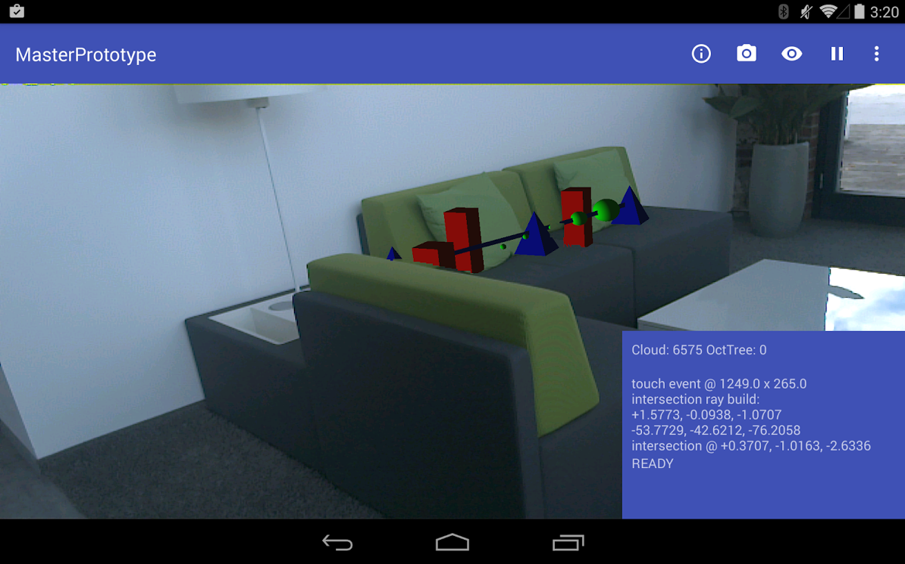

# PoC - Master Thesis 

> Optimierung von Augmented Reality Anwendungen durch die Berücksichtigung von Tiefeninformationen mit Googles Project Tango

### Aktuelles Featureset

#### Augmented Reality (ar)
* Augmented Reality Kamera mit passenden Intrinsics
* Motion Tracking mit korrekter GL Positionierung
* Darstellung der aktuellen PointCloud Scene
* Ray Intersection für eine PointCloud Interaktion
* Simples Tower-Defense Spiel mit Ray Intersection (siehe Screenshot)
* Einfache Pointcloud Occlusion

#### Pointcloud App (pc)
* Exporter der aufgenommenen PointCloud
* Sammeln von PointCloud ausschnitten in einem OctTree

#### Einfache Ebenen Erkennung (construct)
* RANSAC Ebenen Suche in Pointcloud
* Feststellung der korellierenden Punkte
* KMean Cluster Extraction
* QuickHull für convexe Hüllen Erkennung der korellierenden Punkte eines Clusters
* Mesh generierung der convexen Hülle

### Verwendete Librarys
* [Rajawali](https://github.com/Rajawali/Rajawali)
* [tango-examples-java](https://github.com/googlesamples/tango-examples-java)
* [material-dialogs](https://github.com/afollestad/material-dialogs)
* [EventBus](https://github.com/greenrobot/EventBus)
* [commons-math3](https://commons.apache.org/math/)
* [jama](http://math.nist.gov/javanumerics/jama/)
* [QuickHull](https://github.com/Quickhull3d/quickhull3d)

